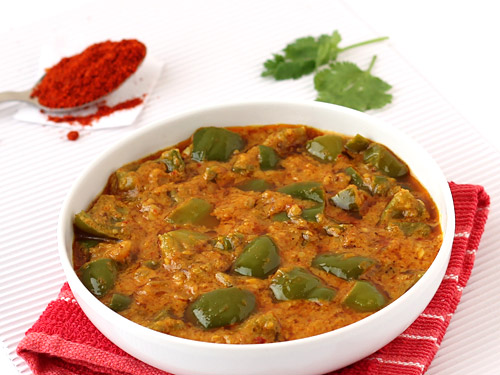

# Sohitha Mallina
I love capsicum for its vibrant flavor and crisp texture, which adds a refreshing crunch to any dish. Its range of colors enhances both the visual appeal and nutritional value of meals. Versatile in cooking, it complements various seasonings and elevates the overall taste of my favorite recipes.

